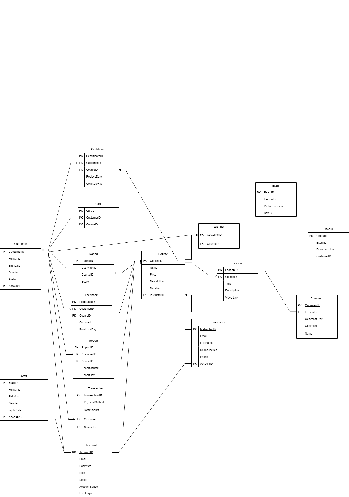

# ADEMY - DRAWING COURSE SELLING PLATFORM

A web application for drawing courses selling

## Authors

- [@AnataAria](https://github.com/AnataAria)
- [@PoserDungeon20033](https://github.com/PoserDungeon2003)
- [@thanlong421999](https://github.com/thanlong421999)
- [@tungphan1011](https://github.com/tungphan1011)

## Mentor

- [@vttvan](https://github.com/vttvan)

## Coding Convention

1. Create your branch related to your work, format: your name/work you do. Ex: thang.ngo/add-jwt
2. Push your branch and create a Pull Request for review
3. If you have merge conflict, contact to the person that are working on that code. <b>DO NOT MERGE CODE WITHOUT
   CONVENTION</b>

## Technologies

<link rel="stylesheet" href="https://cdn.jsdelivr.net/gh/devicons/devicon@v2.15.1/devicon.min.css">

### Framework

<table style="border: none; width: 100%; text-align: center">

  <tr style="width: 100%">
    <td style="text-align: center">
      
    </td>
    <td style="text-align: left">

- JDK: 17
- Spring Boot 3

    </td>
    </tr>
    <tr style="width: 100%">
      <td style="text-align: center"></td>
      <td style="text-align: left">

- Framework 7
  </td>
    </tr>
  </table>

### Database

<table style="border: none; width: 100%; text-align: center">
  <tr>
      <td style="text-align: center">
         
      </td>
      <td style="text-align: left">

- Version: 10.5.19
</td>
  </tr>
</table>

### Deployment

<table style="border: none; width: 100%; text-align: center">
  <tr>
      <td style="text-align: center">
         
      </td>
      <td style="text-align: center">
         
      </td>
      <td style="text-align: center">
         
      </td>
      <td style="text-align: center">
         
      </td>
  </tr>
</table>

---

## ERD Logical

 

---

## Others

[Group Documentation](https://app.clickup.com/9008224118/v/dc/8cex5vp-25)
